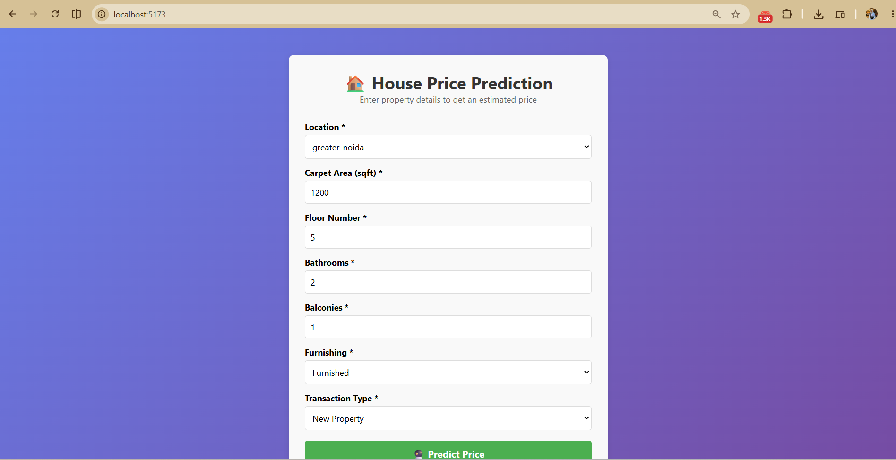
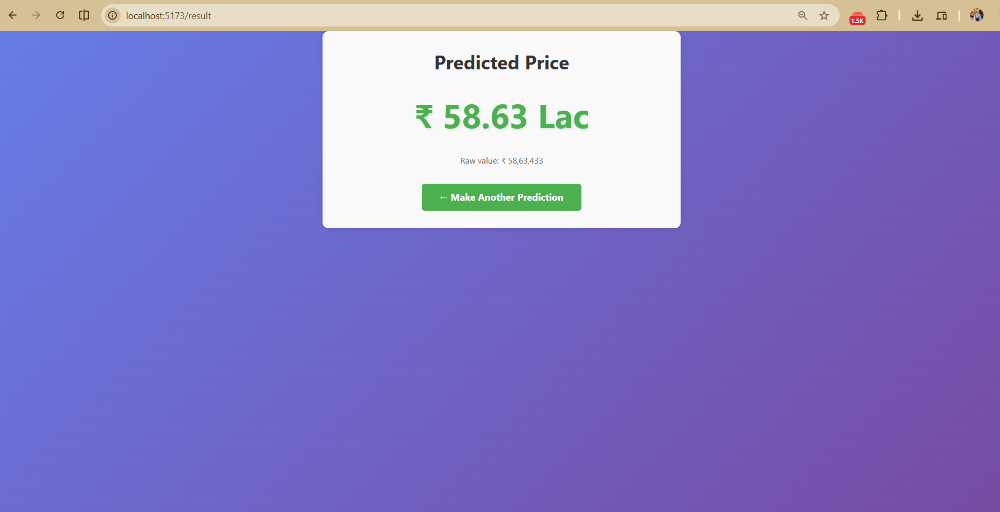

# 🏠 House Price Prediction — End-to-End ML Web App

> Full-stack machine learning application that predicts house prices using real estate data from India.


---

## 📋 Table of Contents

- [Overview](#overview)
- [Architecture](#architecture)
- [Tech Stack](#tech-stack)
- [Dataset](#dataset)
- [Project Structure](#project-structure)
- [Installation](#installation)
- [Usage](#usage)
- [API Reference](#api-reference)
- [Screenshots](#screenshots)
- [Author](#author)
- [License](#license)

---

## 🎯 Overview

This project is a complete machine learning web application for house price prediction.

The application includes:

1. Data processing and preparation
2. A trained machine learning prediction model
3. A FastAPI backend for serving predictions
4. A React + TypeScript frontend
5. A user-friendly interface for entering property information and viewing the predicted price

---

## 🏗️ Architecture

```text
User
  ↓
React Frontend
  ↓
FastAPI Backend
  ↓
Machine Learning Model
  ↓
House Price Prediction
  ↓
React Result Page
'''
🛠️ Tech Stack
Layer
Technology
Machine Learning
Python, Pandas, scikit-learn
Backend
FastAPI, Pydantic, Uvicorn
Frontend
React, TypeScript, Vite
Version Control
Git, GitHub
📊 Dataset
The project uses real estate data for properties in India.
The dataset contains property information such as:
Location
Carpet Area
Furnishing
Floor
Bathrooms
Balcony
Transaction type
Ownership
Facing
Property price
The location information used by the application is stored in:
locations.json
📁 Project Structure
house-price-prediction/
│
├── app/
│   ├── __init__.py
│   ├── main.py
│   │
│   ├── api/
│   │   ├── __init__.py
│   │   └── routes/
│   │       ├── __init__.py
│   │       └── prediction.py
│   │
│   └── schemas/
│       ├── __init__.py
│       └── prediction.py
│
├── frontend/
│   ├── public/
│   ├── src/
│   │   ├── api/
│   │   │   └── predictionClient.ts
│   │   ├── assets/
│   │   ├── pages/
│   │   │   ├── HomePage.tsx
│   │   │   ├── NotFoundPage.tsx
│   │   │   └── ResultPage.tsx
│   │   ├── types/
│   │   │   └── prediction.ts
│   │   ├── App.tsx
│   │   ├── App.css
│   │   ├── index.css
│   │   └── main.tsx
│   │
│   ├── package.json
│   ├── package-lock.json
│   └── vite.config.ts
│
├── .gitignore
├── locations.json
├── requirements.txt
└── README.md
🚀 Installation
Prerequisites
Make sure you have:
Python 3.11+
Node.js 18+
Git
1️⃣ Clone the repository
git clone https://github.com/hannamuhammed/house-price-prediction.git
cd house-price-prediction
2️⃣ Backend Setup
cd app
Create and activate a virtual environment from the project root if needed:
python -m venv venv
venv\Scripts\activate
Install the required Python packages:
pip install -r requirements.txt
3️⃣ Frontend Setup
Open another terminal and run:
cd frontend
npm install
▶️ Usage
Run the Backend
From the project directory:
uvicorn app.main:app --reload
The FastAPI documentation will be available at:
http://localhost:8000/docs
Run the Frontend
From the frontend directory:
npm run dev
Then open the local address shown by Vite in the terminal.
🔌 API Reference
Prediction Endpoint
POST /predict
The endpoint receives property information and returns a predicted house price.
Example request:
{
  "location": "Andheri",
  "carpet_area_sqft": 1200,
  "floor_num": 3,
  "bathroom": 2,
  "balcony": 1,
  "furnishing": "Semi-Furnished",
  "transaction": "New Property",
  "ownership": "Freehold",
  "facing": "East"
}
Example response:
{
  "predicted_price": 4250000.50
}
The exact request fields and response format are defined by the backend schemas and prediction API.
📈 Model Performance
Model performance will be documented here after the final model evaluation.
Metrics such as:
MAE
RMSE
R² Score
will be added after evaluation.
📸 Screenshots




👤 Author
Hanna Muhammed
GitHub: @hannamuhammed⁠
📝 License
This project is created for learning and educational purposes.
